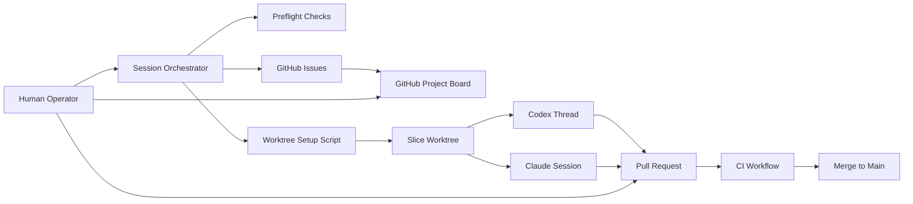
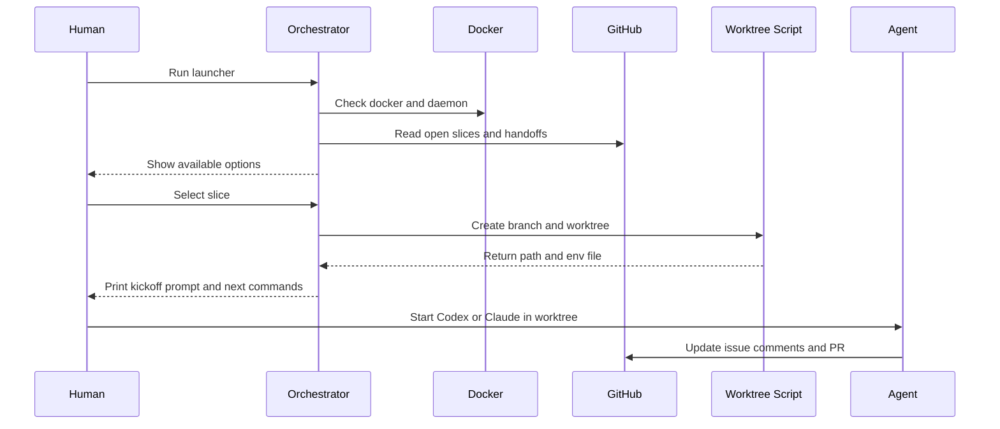
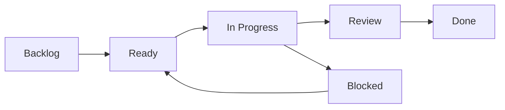
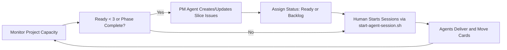

# Agentic Development Showcase

## Purpose

This document explains the local-first agentic development system built for idea2real.

Audience:

- Engineering leadership.
- Product and project stakeholders.
- Team members onboarding into AI-assisted delivery.

## Executive Summary

We designed a human-in-the-loop orchestration model where multiple LLM sessions can work in parallel on one codebase without stepping on each other.

Core idea:

- Strategy stays in docs.
- Execution lives in GitHub Issues and GitHub Project.
- Session startup and routing are automated by local scripts.
- Human operators keep ownership of priorities, approvals, and merge order.

This gives us speed from parallelism without losing control over quality and traceability.

## What We Built

Human operation layer:

- `HUMANS.md`: practical operator playbook.
- `agentic.sh`: compatibility shim that launches a Node.js control panel.
- `tools/agentic-control`: TypeScript CLI/TUI (`Clack`) with structured commands + JSON outputs.
- `docs/project/AGENTIC_CONTROL_PANEL.md`: implementation reference for command contracts and architecture.
- `scripts/start-agent-session.sh`: interactive launcher with discovery + preflight + kickoff generation.
- `scripts/new-slice-worktree.sh`: one-command branch/worktree/env setup.
- `scripts/gh-bootstrap.sh`: one-time GitHub CLI auth/scope/repo/project setup.
- `agentic doctor`: deep environment/workflow validation with explicit fixes.
- `agentic slice finalize`: tests + optional commit + PR/handoff + move issue to Review.
- `agentic pr merge`: merge PR + move issue to Done + cleanup.
- `agentic pr loop`: structured PR feedback rounds with comment templates.

Execution tracking layer:

- GitHub Issues as the unit of work (one slice per issue).
- Handoff notes in issue comments (`Slice`, `Branch`, `Next`, `Blockers`).
- GitHub Project board (`idea2real Web UI`) with flow columns:
  - Backlog.
  - Ready.
  - In Progress.
  - Blocked.
  - Review.
  - Done.

Delivery guardrails:

- Path ownership boundaries by domain.
- Contract-first development for shared interfaces.
- Meaningful TDD as default workflow.
- Security baseline for VPS deployment, prompt safety, and key management.

Session completion automation:

- `scripts/finish-slice-session.sh` standardizes end-of-slice behavior.
- It pushes branch, opens/assigns PR, posts issue handoff summary, and stores local handoff metadata.
- `scripts/cleanup-slice-worktree.sh` standardizes post-merge cleanup of local worktrees and branches.
- `agentic pr loop` standardizes pre-merge triage for review comments, CI failures, and merge conflicts.

Machine-readable contract:

- Every Node CLI action can emit JSON (`--json`) with:
  - `status`
  - `action`
  - `artifacts`
  - `nextSteps`
  - `errors`

## System Diagram



## Session Startup Sequence



## Slice Lifecycle



## Pre-Merge Feedback Gate

Before merge, operators run the PR feedback loop to triage:

- unresolved review threads,
- change requests,
- failing/pending checks,
- merge conflicts.

If blockers exist, the loop opens/resumes a fix worktree and moves status back to `In Progress` (or `Blocked` for conflicts).

## PM Replenishment Cycle

Issue generation is continuous, not one-time setup.

Rules:

- Keep at least 3 unassigned slices in `Ready`.
- When a phase/sprint completes, immediately seed the next one.
- When blockers uncover hidden work, add new slices within the same day.



Operationally, this keeps execution flowing and prevents agent idle time.

## Why This Works

Parallelism with boundaries:

- Multiple sessions can execute simultaneously.
- Worktree-per-session and branch-per-slice remove edit collisions.

Traceability:

- Every slice has issue history, comments, statuses, and linked PRs.
- Handoff context is durable and searchable.

Operational clarity:

- Human decides what starts next.
- Agents execute bounded scopes.
- Project board shows real-time flow.

Quality:

- TDD + contract-first workflow reduces hidden regressions.
- CI and PR review gates stay central.

Security:

- Prompt injection is treated as untrusted-input risk, not just model behavior.
- Secrets stay server-side with rotation and least privilege.
- VPS hardening and abuse controls are part of delivery gates.

## Demo Script for Stakeholders

Use this live demo to show the system in under 10 minutes.

1. Show board and open slices:

```bash
gh project view 1 --owner luisnomad
gh issue list -R luisnomad/idea2real --label slice --state open
```

2. Start one session with orchestration:

```bash
./agentic.sh
```

3. Show resulting worktree and kickoff file:

```bash
ls -la ../idea2real-p0-web-1
cat ../idea2real-p0-web-1/.sessions/kickoff-P0-WEB-1.md
```

4. Show how issue and project become the operational source of truth.

5. Show slice finalization automation:

```bash
cd ../idea2real-p0-infra-1
./scripts/finish-slice-session.sh \
  --done "Implemented infra slice deliverables" \
  --next "Ready for review and merge" \
  --blockers "None"
```

## Governance Model

Human responsibilities:

- Prioritization.
- Slice ownership assignment.
- Approvals for merges.
- Conflict resolution across domains.

Agent responsibilities:

- Implement one slice at a time.
- Respect declared path boundaries.
- Leave clear handoff notes.
- Run targeted tests and report risk.

## PM Agent Prompt Template

Use this prompt in a dedicated PM session to prepare the next sprint/phase:

```text
You are the PM agent for idea2real.

Goal:
- Replenish GitHub Project "idea2real Web UI" so Ready always has at least 3 unassigned slices.
- Prepare the next phase based on docs/project/DEVELOPMENT_PLAN.md.

Instructions:
1) Identify the next unfinished phase from docs/project/DEVELOPMENT_PLAN.md.
2) Break it into slices by domain: frontend, api, geometry, contracts, infra, security.
3) For each slice, include:
   - Slice ID
   - Depends On
   - Paths Touched
   - Behavior Contract (Given/When/Then)
   - Test Plan
   - Definition of Done
4) Create GitHub issues with "slice" + phase/domain labels.
5) Add issues to project luisnomad#1 and set status:
   - Ready for immediately actionable slices
   - Backlog for deferred slices
6) Prevent duplicates by checking existing Slice IDs before issue creation.
7) Report created issue URLs, duplicates skipped, and final Ready count.
```

## Suggested KPIs

- Lead time per slice.
- Rework rate from review feedback.
- Parallel slices active at once.
- Blocked slice count and average block duration.
- PR cycle time and merge success rate.
- Security gate pass rate before release.
- Mean time to rotate compromised credentials (drill metric).

## Current Status

Operational pieces are in place:

- Local orchestrator.
- Worktree automation.
- GitHub CLI bootstrap.
- Issue creation with project auto-add.
- Human and agent operating docs.
- Security baseline document with production controls.

This is ready to run as a repeatable team workflow.
